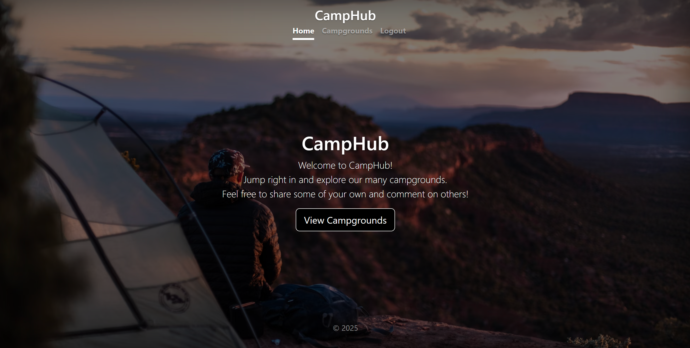

# CampHub
 
I developed a project called 'Camphub,' a dynamic web application that allows users to explore campgrounds across the country. The platform provides detailed information about each campground, including its location displayed on a map, user ratings, reviews, and images that highlight the site.

The application also includes a feature for campground owners, enabling them to create and manage their campground listings. Owners can add new campgrounds by providing details such as the name, location, description, and images. Additionally, they have the ability to edit or delete campgrounds they’ve previously added.

For the backend, I utilized the MERN stack, which includes MongoDB for storing campground data, user information, and reviews, Express.js and Node.js for building a RESTful API to handle requests and perform server-side operations.

On the frontend, I built a clean and interactive user interface using HTML, CSS, and JavaScript to ensure a smooth user experience. The integration of React further enhanced the application by enabling fast and responsive UI updates through its component-based architecture.

By combining these technologies, 'Camphub' offers a seamless and efficient platform for both users and campground owners, providing an engaging and user-friendly experience
